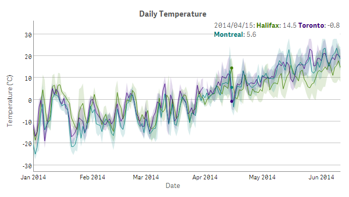
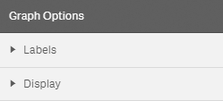
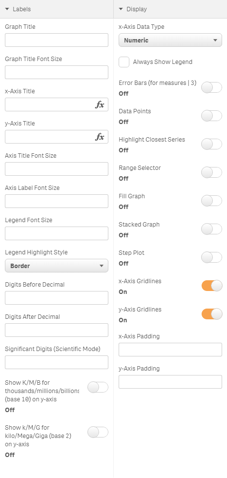

# dygraphs for Qlik Sense

Create customizable, interactive charts with Qlik Sense using the dygraphs library.

## Table of Contents

- [Description](#description)
- [Screenshots](#screenshots)
- [Installation](#installation)
- [Usage](#usage)
  - [Dimensions and Measures](#dimensions-and-measures)
  - [Default Interaction](#default-interaction)
  - [Graph Options](#graph-options)
    - [Labels](#labels)
    - [Display](#display)
- [License](#license)

***

## Description

This visualization extension allows dygraphs charts to be integrated with Qlik Sense.  It makes use of the [dygraphs](http://dygraphs.com/) JavaScript library to produce interactive, zoomable charts.  The extension incorporates a selection of the dygraphs library's customization options to offer numerous possibilities for chart configuration, display and interactivity.

## Screenshots

## Installation

1. Download the content.
2. Deploy the extension to your Qlik Sense environment.
   * Qlik Sense Desktop:
     Copy the entire contents of the .zip file to  
     "C:\\Users\\\<UserName\>\\Documents\\Qlik\\Sense\\Extensions\\qs-dygraphs"

   * Qlik Sense Server:
     Follow the instructions for ["Deploying visualizations in Qlik Sense"](http://help.qlik.com/sense/2.0/en-US/developer/#../Subsystems/Extensions/Content/Howtos/deploy-extensions.htm%3FTocPath%3DBuilding%2520visualization%2520extensions|Working%2520with%2520visualization%2520extensions|_____9)

3. (Optional) Import the demo app to your Qlik Sense environment.
   * Qlik Sense Desktop:
     Copy the dygraphs for Qlik Sense demo .qvf file from the demo folder within the qs-dygraphs directory to  
     "C:\\Users\\\<UserName>\\Documents\\Qlik\\Sense\\Apps"

   * Qlik Sense Server:
     Follow the instructions for ["Importing apps"](http://help.qlik.com/sense/2.0/en-US/online/#../Subsystems/ManagementConsole/Content/import-apps.htm%3FTocPath%3DAdministering%2520Qlik%2520Sense%7CManaging%2520a%2520Qlik%2520Sense%2520site%7CManaging%2520QMC%2520resources%7CManaging%2520apps%7C_____1)

## Usage

Open a Qlik Sense app sheet, start Edit mode, then drag and drop **dygraphs** from the Charts menu onto the sheet.

### Dimensions and Measures
Set the dimension to provide values for the x-axis.

Choose a measure for each data series to be displayed.&nbsp;&nbsp;This may be a field or an expression.

Set the label property of each measure to provide a name for the data series in the chart's legend.

### Default Interaction

A dygraphs chart is interactive by default.&nbsp;&nbsp;Move the mouse pointer over the chart to highlight individual values.  Click and drag horizontally or vertically to zoom and Shift-click and drag to pan.  Restore the initial extent of the chart by double-clicking.

**Highlight**: mouse over

**Zoom**: click-drag (horizontal or vertical)

**Pan**: <kbd>Shift</kbd> + click-drag

**Reset**: double-click

### Graph Options
The Graph Options menu consists of two sections, [Labels](#labels) and [Display](#display).&nbsp;&nbsp;The Labels section includes settings for all text elements in the dygraphs object (with the exception of series labels, which are set with measures properties &ndash; see [Dimensions and Measures](#dimensions-and-measures), above).&nbsp;&nbsp;The Display section includes settings for all of the graphic elements of the dygraphs object, such as data series and axes.

_Graph Options_

_Labels and Display sections &ndash; expanded_

#### Labels

* **`Graph Title`** - Text to display above the chart, centered.&nbsp;&nbsp;HTML character entities may be used in addition to plain text.  (_text; default: null_)

* **`Graph Title Font Size`** - Size of the font to use for the graph title, in pixels. (_integer; default: 20_)

* **`x-axis Title`** - Text to display below the chart's x-axis.&nbsp;&nbsp;HTML character entities may be used in addition to plain text. (_text; default: null_)

* **`y-axis Title`** - Text to display to the left of the chart's y-axis.&nbsp;&nbsp;HTML character entities may be used in addition to plain text. (_text; default: null_)

* **`Axis Title Font Size`** - Size of the font to use for both the x-axis and y-axis titles, in pixels. (_integer; default: 16_)

* **`Axis Label Font Size`** - Size of the font to use for both the x-axis and y-axis labels, in pixels. (_integer; default 14_)

* **`Legend Font Size`** - Size of the font to use for the legend text, in pixels. (_integer; default 14_)

* **`Legend Highlight Style`** - Style to use for highlighting text in the legend for the data series closest to the mouse pointer when **`Highlight Closest Series`** is turned on.&nbsp;&nbsp;This may be set to Border, Fill or Single Series. (_default: Border_)

* **`Digits Before Decimal`** - Number of digits to display before the decimal point.&nbsp;&nbsp;Numbers with more digits to the left of the decimal than this value will be displayed in scientific notation.
(_integer; default: 6_)

* **`Digits After Decimal`** - Number of digits to display after the decimal point (trailing zeros are not displayed).&nbsp;&nbsp;If a number has absolute value less than 0.1 to the power of this value, it will be displayed in scientific notation. (_integer; default: null_)

* **`Significant Digits (Scientific Mode)`** - Fixed number of significant figures to display, in scientific notation.&nbsp;&nbsp;By default, numbers are displayed with a fixed number of digits after the decimal point. (_integer; default: null_)

* **`Show K/M/B for thousands/millions/billions (base 10) on y-axis`** - Base 10 abbreviations for y-axis labels. (_default: Off_)

* **`Show K/M/G for kilo/Mega/Giga (base 2) on y-axis`** - Base 2 abbreviations for y-axis labels. (_default: Off_)

#### Display

* **`x-Axis Data Type`** - The data type for values on the x-axis (the dimension).&nbsp;&nbsp;This may be set to either Numeric or Date.
(_default: Numeric_)

* **`Always Show Legend`** - Always display a legend.&nbsp;&nbsp;By default, the legend only appears when the mouse pointer is over the chart.
(_default: false_)

* **`Error Bars (for measures | 3)`** - When enabled, each set of three measures will be interpreted as 'low;middle;high'. Error bars will be drawn for each point between low and high, with the series itself going through middle.  Therefore, for each series to be displayed with error bars, three measures are required and they should be arranged by value in ascending order (i.e. low, middle, high).
(_default: Off_)

* **`Data Points`** - Draw a small dot at each data point in addition to the line that passes through.
(_default: Off_)

* **`Highlight Closest Series`** - When set, the data series closest to the mouse pointer will be highlighted.&nbsp;&nbsp;Highlighted series will be rendered with thicker lines and larger data points while other series will be rendered with partial transparency.
(_default: Off_)

* **`Range Selector`** - Enable the range selector widget.&nbsp;&nbsp;This disables the default click-drag zoom interaction.
(_default: Off_)

* **`Fill Graph`** - Fill the area underneath each data series.&nbsp;&nbsp;This option is not compatible with error bars.
(_default: Off_)

* **`Stacked Graph`** - Stack series on top of one another rather than drawing them independently.&nbsp;&nbsp;Series will be stacked from top to bottom in the same order that measures are arranged in the properties panel.
(_default: Off_)

* **`Step Plot`** - Display the graph as a step plot instead of a line plot.
(_default: Off_)

* **`x-Axis Gridlines`** - Display vertical gridlines under the chart.
(_default: On_)

* **`y-Axis Gridlines`** - Display horizontal gridlines under the chart.
(_default: On_)

* **`x-Axis Padding`** - Amount of extra space around the x-axis value range to ensure points at the edges remain visible, in pixels.
(_float; default: 0_)

* **`y-Axis Padding`** - Amount of extra space around the y-axis value range to ensure points at the edges remain visible, in pixels.
(_float; default: null_)

## License

Copyright © 2015 Daniel Pierre

Released under the MIT license.